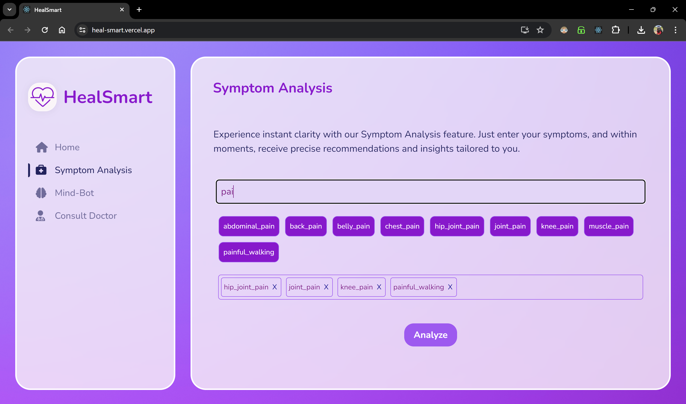
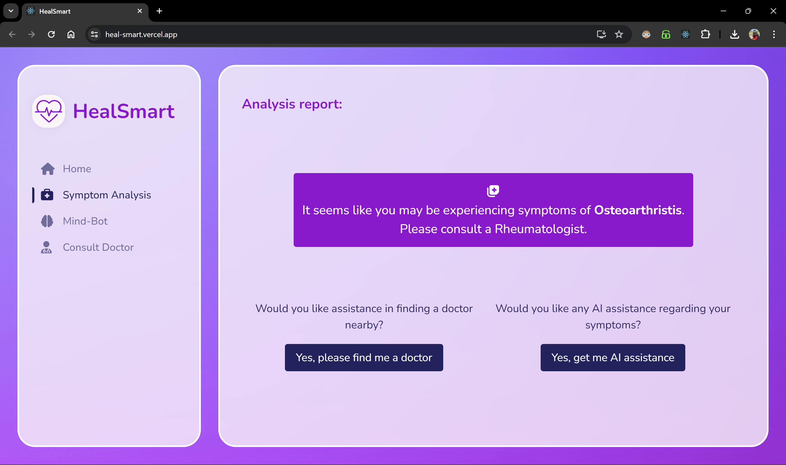
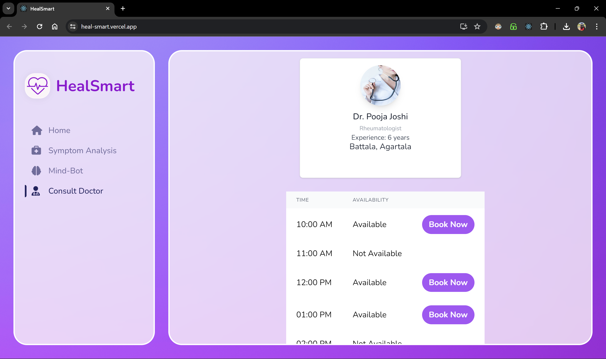

# HealSmart: A Medical Assistant Web Application
 
Welcome to the HealSmart, a medical assistant web application repository! This project aims to develop a comprehensive healthcare recommendation system that assists users in navigating their symptoms, accessing appropriate specialists, and ultimately improving their overall healthcare experience. Leveraging advanced technologies and user-centric design principles, my goal is to empower individuals in making informed healthcare decisions and enhancing their well-being. This is developed as a solution for 2024 Girl Hackathon Ideathon Round for the problem statement "Medical Assistant". The detailed problem statement and proposed solution are mentioned furthur in the document.
 
## Web App link
 
Click [here]() to visit the web app.
 
## Problem Statement
 
I have to develop a healthcare recommendation system that analyzes user symptoms leveraging symptom data (using mock data), healthcare provider databases, and user ratings,  recommends doctors with matching specialties and aligned schedules.
 
## Features
 
- **Symptom Analysis:** It uses a Python-based ML model, seamlessly integrated via a Flask application, to predict diseases from user symptoms. This not only directs users to the most suitable specialist doctors but also provides AI-driven preliminary recommendations.
- **Mind-Bot:** It provides essential mental support through empathetic conversations, utilizing GenAI (Gemini API) to address prevalent issues such as loneliness and mental health concerns, with sensitivity and understanding. 
- **Consult Doctor:** It streamlines the process of finding and booking appointments with specialists, presenting user-friendly interfaces and utilizing Firebase to simulate a dummy healthcare provider database.
 
## Architecture
 

 
## Demo
 
### Screenshots
 
- **Home Page**
  
 
- **Symptom Analysis**
  
 
- **Analysis Result**
  
 
- **AI Consultation**
  
 
- **Mind-Bot**
  
 
- **Consult Doctor**
  
 
- **Doctor Appointment**
  
 
### Working
 
- **Symptom Analysis:** Users input their symptoms into the web application. The ML model predicts possible diseases based on the symptoms provided, recommending appropriate specialist categories for further consultation. Users also have the option to get some AI-driven preliminary measures.
- **Mind-Bot:** Users engage with the chatbot feature to receive mental support and guidance. The chatbot offers empathetic responses and provides resources to address mental health concerns.
- **Consult Doctor:** Users browse through a list of doctors with various specializations, viewing their basic details and ratings. They can then select a doctor and book appointments directly through the web application.
 
## Technologies Used
 
- **Frontend:** HTML, CSS, Tailwind CSS, JavaScript, React
- **Backend:** Python (Flask)
- **Machine Learning:** Logistic Regression
- **APIs:** Gemini API
- **Database:** Firebase Firestore(for simulating dummy healthcare provider database)
 
## Purpose and Use Cases
 
My aim is to provide a comprehensive healthcare recommendation system that leverages symptom data, healthcare provider databases, and user ratings. This solution is designed to assist users in analyzing their medical conditions, accessing appropriate specialists, and ultimately improving their overall healthcare experience. Not only that, it also
destigmatizes mental health issues and encourages users to seek help when needed by conversing with AI powered ‘Mind-Bot’ of the application. My target audience includes individuals seeking efficient and personalized healthcare guidance in navigating their symptoms and accessing quality medical care. By combining advanced technology with user-centric design, I aspire to empower users in making informed healthcare decisions and enhancing their well-being.
 